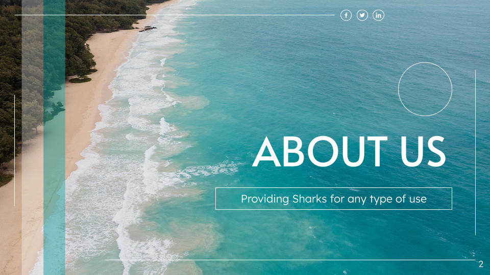

# Shark Tale Project 🦈


Welcome to the Shark Tale project repository! This project dives into the intriguing world of shark sales, providing a comprehensive analysis of trends, species, and activities associated with the shark trade. Whether you're interested in the data or just shark-curious, you've come to the right place!

## Repository Structure 📁

- **/raw_data**: Contains the raw datasets as collected from various sources.
- **/clean_data**: Here you'll find the data after it's been cleaned and preprocessed, ready for analysis.
- **/notebooks**:
  - `data_cleaning.ipynb`: Notebook for data cleaning procedures.
  - `exploratory_data_analysis.ipynb`: Notebook containing exploratory data analysis and visualizations.

## Project Overview 📊


The Shark Tale project aims to provide insights into the global shark market by analyzing sales data from different continents. This includes understanding which shark species are most popular in trades, where the main markets are located, and the age distribution of sharks involved in these transactions.

Our data cleaning process involves handling missing values, formatting dates and times, and normalizing data across different sources. The exploratory data analysis (EDA) focuses on visualizing sales trends, demographic data, and geographic patterns using Python's powerful libraries like matplotlib and pandas.

## Technologies Used 🛠️

- Python
- Pandas: For data manipulation and analysis.
- NumPy: For numerical data processing.
- Matplotlib: For creating static, interactive, and animated visualizations in Python.
- Google Looker Studio: For enhanced visual analytics.

## Getting Started 🚀

To get started with this project, clone this repo to your local machine. Ensure you have Python installed, and install the necessary packages using:

```bash
pip install -r requirements.txt
```

You can then navigate to the `/notebooks` directory to view the Jupyter notebooks.

## Acknowledgments 🙌

- Hat tip to anyone whose code was used
- Special thanks to the data providers and supporters of our project


